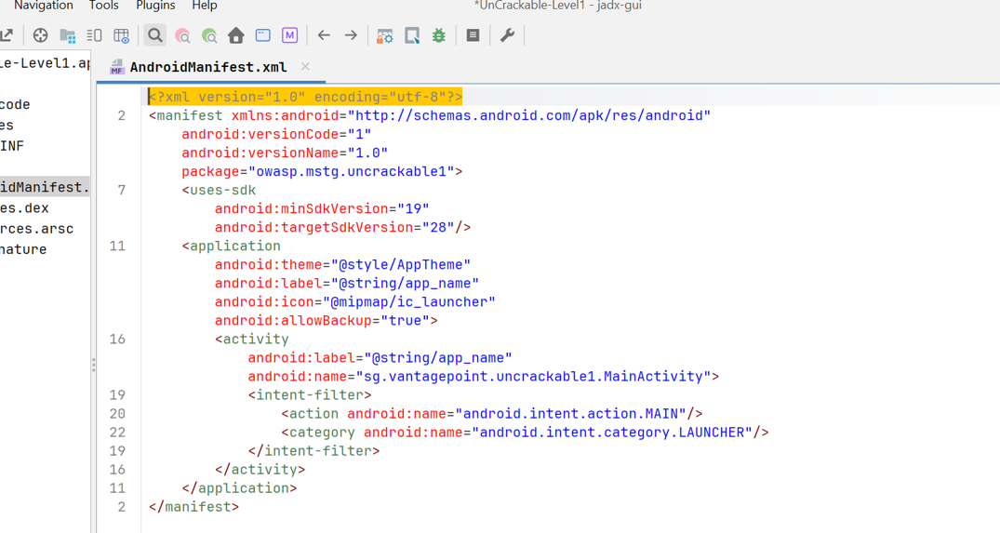
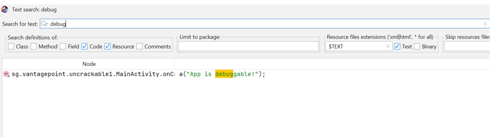
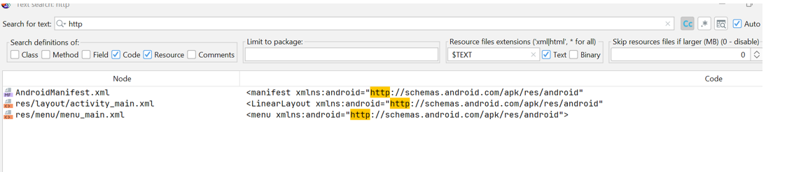

#  Analyse statique APK - UnCrackable Level 1

##  Description
Ce projet présente une analyse statique de l’application Android **UnCrackable-Level1.apk** dans le cadre d’un laboratoire de cybersécurité.

L’objectif est d’identifier les failles potentielles à travers :
- Analyse du manifeste
- Recherche de chaînes sensibles
- Décompilation du code

##  Outils utilisés
- JADX GUI
- dex2jar
- JD-GUI

##  Résultats principaux

###  1. Activité exportée implicitement
L’activité principale contient un `intent-filter`, ce qui la rend accessible depuis d'autres applications.

Illustration :

---

### 2. Présence du mode debug
Une chaîne `"App is debuggable!"` a été détectée dans le code.

 Illustration :

---

### 3. Absence de communication externe
Aucune URL externe ou API n’a été trouvée dans l’application.

 Illustration :

---

##  Rapport
Le rapport complet d’analyse est disponible dans le dossier **results**.
